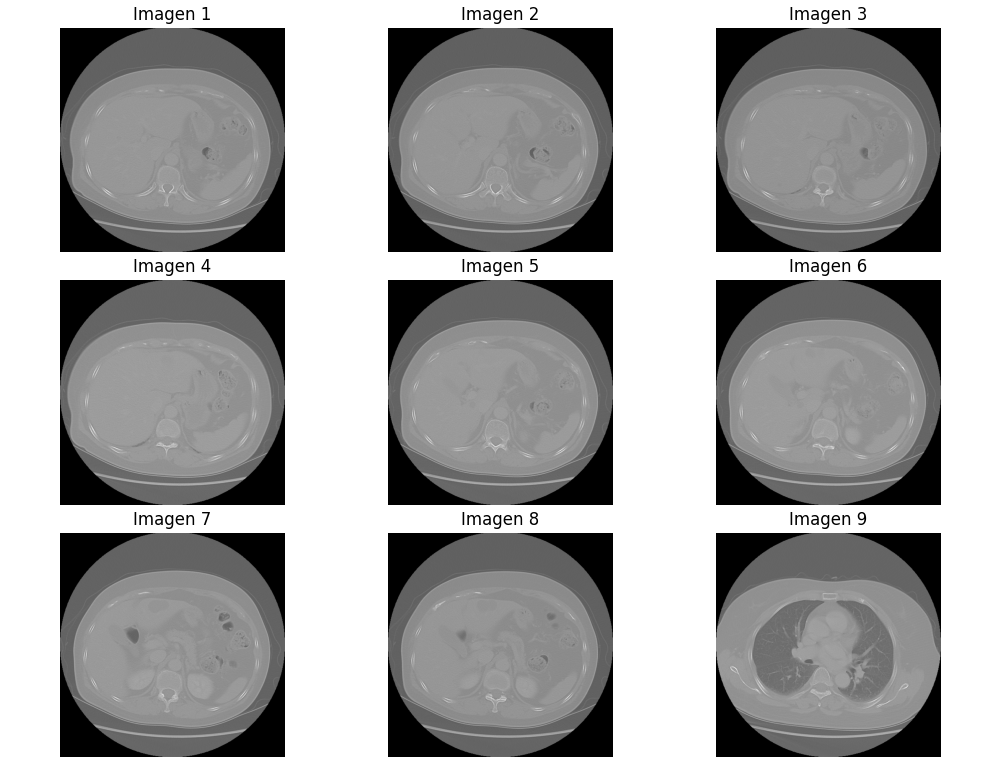
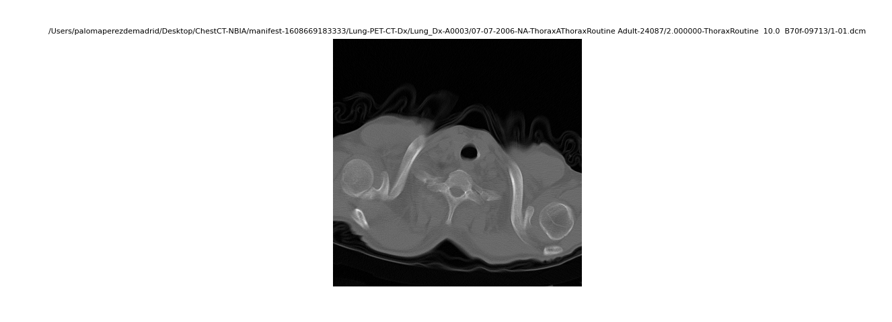
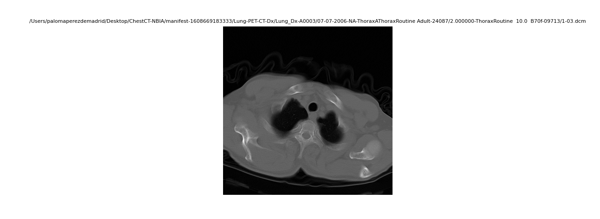
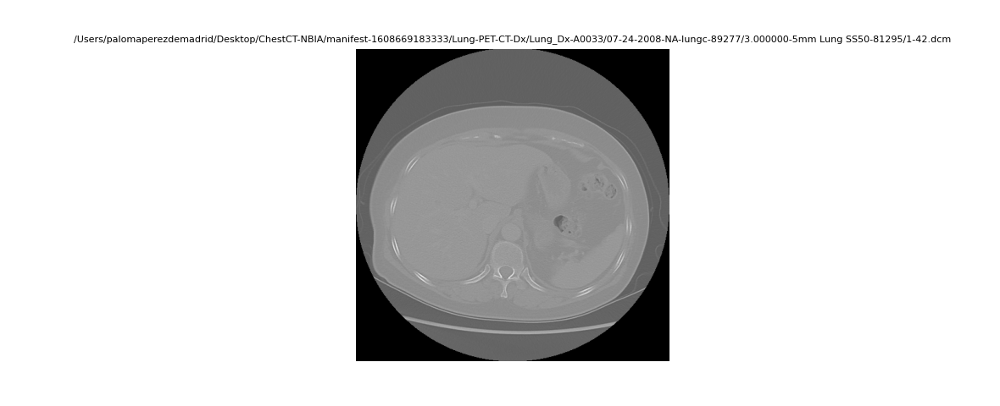
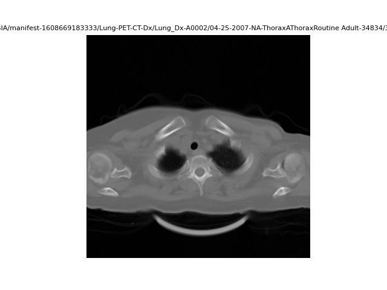

# Datos

Los datos descargados vienen de The Cancer Imaging Archive (TCIA), en concretom imágenes de tomografías en formato DICOM (Lung-PET-CT-Dx)

# Probar el código
1) Descargarte el manifest de https://www.cancerimagingarchive.net/collection/lung-pet-ct-dx/ (un archivo .tcia)
2) Descargarte la apliación de NBIA y abrir el manifest (se empezarán cargar las imágenes)
3) En la variable `base_dir` indica donde se encuentra la carpeta *Lung-PET-CT-Dx* 
4) Puedes comentar y descomentar las diferentes funciones, la variable `subject_folder`hace referencia a la carpeta con los datos de un sujeto.

# Procesamiento de datos

Con `get_dicom_files()` sacamos el número de archivos DICOM y las primeras rutas de estos archivos.
```bash
Se encontraron 29752 archivos DICOM.
Primeras 10 rutas:
../../../../ChestCT-NBIA/manifest-1608669183333/Lung-PET-CT-Dx/Lung_Dx-A0033/07-24-2008-NA-lungc-89277/3.000000-5mm Lung SS50-81295/1-42.dcm
../../../../ChestCT-NBIA/manifest-1608669183333/Lung-PET-CT-Dx/Lung_Dx-A0033/07-24-2008-NA-lungc-89277/3.000000-5mm Lung SS50-81295/1-43.dcm
../../../../ChestCT-NBIA/manifest-1608669183333/Lung-PET-CT-Dx/Lung_Dx-A0033/07-24-2008-NA-lungc-89277/3.000000-5mm Lung SS50-81295/1-41.dcm
../../../../ChestCT-NBIA/manifest-1608669183333/Lung-PET-CT-Dx/Lung_Dx-A0033/07-24-2008-NA-lungc-89277/3.000000-5mm Lung SS50-81295/1-40.dcm
../../../../ChestCT-NBIA/manifest-1608669183333/Lung-PET-CT-Dx/Lung_Dx-A0033/07-24-2008-NA-lungc-89277/3.000000-5mm Lung SS50-81295/1-44.dcm
../../../../ChestCT-NBIA/manifest-1608669183333/Lung-PET-CT-Dx/Lung_Dx-A0033/07-24-2008-NA-lungc-89277/3.000000-5mm Lung SS50-81295/1-45.dcm
../../../../ChestCT-NBIA/manifest-1608669183333/Lung-PET-CT-Dx/Lung_Dx-A0033/07-24-2008-NA-lungc-89277/3.000000-5mm Lung SS50-81295/1-47.dcm
../../../../ChestCT-NBIA/manifest-1608669183333/Lung-PET-CT-Dx/Lung_Dx-A0033/07-24-2008-NA-lungc-89277/3.000000-5mm Lung SS50-81295/1-46.dcm
../../../../ChestCT-NBIA/manifest-1608669183333/Lung-PET-CT-Dx/Lung_Dx-A0033/07-24-2008-NA-lungc-89277/3.000000-5mm Lung SS50-81295/1-21.dcm
../../../../ChestCT-NBIA/manifest-1608669183333/Lung-PET-CT-Dx/Lung_Dx-A0033/07-24-2008-NA-lungc-89277/3.000000-5mm Lung SS50-81295/1-35.dcm
```

Todas esas imágenes están dentro de una misma serie de datos médicos (Lung_Dx-A0033, el `subject_id`) de un paciente específico, lo que sugiere que podrían ser cortes o imágenes de tomografía computarizada (CT) del mismo pulmón. Las rutas también indican que las imágenes corresponden a diferentes cortes de una misma serie (por ejemplo, 1-42.dcm, 1-43.dcm, etc.).

El hecho de que estén organizadas en la misma carpeta y compartan un identificador común en su ruta sugiere que todas podrían pertenecer al mismo pulmón y, por lo tanto, podrían ser de la misma serie de imágenes de diagnóstico (CT o PET-CT)


La función `show_dicom_images()` muestra 9 imágenes generadas a partir del archivo DICOM.



# Metadatos
Para organizar los datos, el programa nos facilita un `metadata.csv`

Por ejemplo para el suejeto A0003 tenemos la siguiente información:
```bash
1.3.6.1.4.1.14519.5.2.1.6655.2359.144797390935445988841819830728	Lung-PET-CT-Dx	null	https://doi.org/10.7937/TCIA.2020.NNC20461	Lung_Dx-A0003	1.3.6.1.4.1.14519.5.2.1.6655.2359.179476503242496939309318824087	ThoraxAThoraxRoutine Adult	07-07-2006	ThoraxRoutine  10.0  B40f	SIEMENS	CT	CT Image Storage	1.2.840.10008.5.1.4.1.1.2	27	14	24 MB	./Lung-PET-CT-Dx/Lung_Dx-A0003/07-07-2006-NA-ThoraxAThoraxRoutine Adult-24087/3.000000-ThoraxRoutine  10.0  B40f-30728	2025-01-18T18:14:51.897
1.3.6.1.4.1.14519.5.2.1.6655.2359.312598322891506138432125709713	Lung-PET-CT-Dx	null	https://doi.org/10.7937/TCIA.2020.NNC20461	Lung_Dx-A0003	1.3.6.1.4.1.14519.5.2.1.6655.2359.179476503242496939309318824087	ThoraxAThoraxRoutine Adult	07-07-2006	ThoraxRoutine  10.0  B70f	SIEMENS	CT	CT Image Storage	1.2.840.10008.5.1.4.1.1.2	27	14	24 MB	./Lung-PET-CT-Dx/Lung_Dx-A0003/07-07-2006-NA-ThoraxAThoraxRoutine Adult-24087/2.000000-ThoraxRoutine  10.0  B70f-09713	2025-01-18T18:14:52.137
1.3.6.1.4.1.14519.5.2.1.6655.2359.291101486042760745473304995444	Lung-PET-CT-Dx	null	https://doi.org/10.7937/TCIA.2020.NNC20461	Lung_Dx-A0003	1.3.6.1.4.1.14519.5.2.1.6655.2359.191296879859645325850052837655	Chest	07-25-2006	5mm	Philips	CT	CT Image Storage	1.2.840.10008.5.1.4.1.1.2	1	527	34 KB	./Lung-PET-CT-Dx/Lung_Dx-A0003/07-25-2006-NA-Chest-37655/2.000000-5mm-95444	2025-01-18T18:14:52.57
1.3.6.1.4.1.14519.5.2.1.6655.2359.516695927127321841501506002400	Lung-PET-CT-Dx	null	https://doi.org/10.7937/TCIA.2020.NNC20461	Lung_Dx-A0003	1.3.6.1.4.1.14519.5.2.1.6655.2359.191296879859645325850052837655	Chest	07-25-2006	5mm	Philips	CT	CT Image Storage	1.2.840.10008.5.1.4.1.1.2	2	1	05 MB	./Lung-PET-CT-Dx/Lung_Dx-A0003/07-25-2006-NA-Chest-37655/3.000000-5mm-02400	2025-01-18T18:14:54.36
1.3.6.1.4.1.14519.5.2.1.6655.2359.466719587716993334662150946438	Lung-PET-CT-Dx	null	https://doi.org/10.7937/TCIA.2020.NNC20461	Lung_Dx-A0003	1.3.6.1.4.1.14519.5.2.1.6655.2359.197033995568008710397567584219	Chest	07-21-2006	5mm	Philips	CT	CT Image Storage	1.2.840.10008.5.1.4.1.1.2	1	527	34 KB	./Lung-PET-CT-Dx/Lung_Dx-A0003/07-21-2006-NA-Chest-84219/3.000000-5mm-46438	2025-01-18T18:14:54.467
1.3.6.1.4.1.14519.5.2.1.6655.2359.124466459064289446938479156882	Lung-PET-CT-Dx	null	https://doi.org/10.7937/TCIA.2020.NNC20461	Lung_Dx-A0003	1.3.6.1.4.1.14519.5.2.1.6655.2359.197033995568008710397567584219	Chest	07-21-2006	5mm	Philips	CT	CT Image Storage	1.2.840.10008.5.1.4.1.1.2	12	6	33 MB	./Lung-PET-CT-Dx/Lung_Dx-A0003/07-21-2006-NA-Chest-84219/2.000000-5mm-56882	2025-01-18T18:14:55.975
```

Y la siguiente estructura de directorios

```bash
cd Lung_Dx-A0003 
Lung_Dx-A0003 % ls
07-07-2006-NA-ThoraxAThoraxRoutine Adult-24087	
07-25-2006-NA-Chest-37655
07-21-2006-NA-Chest-84219
```

**Análisis de las 3 carpetas:**

1.  `07-07-2006-NA-ThoraxAThoraxRoutine Adult-24087`
   - **Fecha de adquisición**: 07-07-2006
   - **Área del cuerpo**: Torax (Thorax), posiblemente una exploración de rutina para adultos.
   - **Tipo de estudio**: `ThoraxAThoraxRoutine Adult`, que parece ser una exploración de tórax de rutina en adultos.
   - **Tamaño**: 24 MB
   - **Fabricante**: SIEMENS
   - **Modalidad**: Tomografía Computarizada (CT)
   - **Identificador único**: `1.3.6.1.4.1.14519.5.2.1.6655.2359.179476503242496939309318824087`

2. `07-21-2006-NA-Chest-84219`
   - **Fecha de adquisición**: 07-21-2006
   - **Área del cuerpo**: Pecho (Chest)
   - **Tipo de estudio**: Estudio de pecho, probablemente una tomografía de tórax también.
   - **Tamaño**: 34 KB
   - **Fabricante**: Philips
   - **Modalidad**: Tomografía Computarizada (CT)
   - **Identificador único**: `1.3.6.1.4.1.14519.5.2.1.6655.2359.197033995568008710397567584219`

3. `07-25-2006-NA-Chest-37655`
   - **Fecha de adquisición**: 07-25-2006
   - **Área del cuerpo**: Pecho (Chest)
   - **Tipo de estudio**: De nuevo, un estudio de tórax, similar al anterior.
   - **Tamaño**: 24 MB
   - **Fabricante**: Philips
   - **Modalidad**: Tomografía Computarizada (CT)
   - **Identificador único**: `1.3.6.1.4.1.14519.5.2.1.6655.2359.191296879859645325850052837655`

Para poder observar todas las imágenes de un sujeto (a pesar de que estén en diferentes subcarpetas) podemos usar la función `show_subject_images()`

Hay imágenes que no nos conviene como:

Ruta: ThoraxAThoraxRoutine/2.0000


Ruta: ThoraxAThoraxRoutine/2.0000

Lo mismo pasa con la carpeta 07-25-2006-NA-Chest-37655/2.000000-5mm-95444
Podríamos plantearnos coger solo los datos de las carpetas "3.00000"

También hay imágenes extrañas como el sujeto A0033 NA Lungc, habría que descartar todos los "study description" que no sean "Chest" o "ThoraxAThoraxRoutine Adult"

Aceptamos como Study Description:
- Chest (Lung_Dx-A0001)
- ThoraxAThoraxRoutine Adult (Lung_Dx-A0002)
- Chest  3D IMR (Lung_Dx-A0083)
- Chest  3D (Lung_Dx-A0103)

Rechazamos como Study Description:
- C-SP Chest (Lung_Dx-A0006)
- lungc (Lung_Dx-A0019)
- POS (Lung_Dx-A0025)
- LUNG (Lung_Dx-A0020)
- CHEST (Lung_Dx-A0016)
- C-J (Lung_Dx-A0021)
- LUNGCTA (Lung_Dx-A0030)
- lung (Lung_Dx-A0023)
- LUNGC (Lung_Dx-A0046)
- CHC (Lung_Dx-A0053)
- CC (Lung_Dx-A0055)
- cc (Lung_Dx-A0066)
- ch (Lung_Dx-A0059)
- 5mm chest (Lung_Dx-A0062)
- HeadBHead6MM Adult (Lung_Dx-A0063)
- lungc GSI (Lung_Dx-A0069)
- Chest 3 (Lung_Dx-A0070)
- ABC (Lung_Dx-A0064)
- e1 lung (Lung_Dx-A0074)
- ThoraxAThoraxRoutine Adult (Lung_Dx-A0078)
- chest.3d (Lung_Dx-A0096)
- ch.3d ao.cta (Lung_Dx-A0104)

Nota: el sujeto entre paréntesis es un sujeto ejemplo del estilo de tomografía.

Ahora queda averiguar como obtener imágenes con el plano de la tomografía similar: \



1. **Primera imagen**:  
   - Es un corte superior, a la altura de la región clavicular y parte alta del tórax.  
   - Se pueden observar estructuras óseas como las clavículas y las primeras costillas.  
   - También se visualiza la tráquea en sección transversal con su lumen oscuro.  

2. **Segunda imagen**:  
   - Es un corte más inferior, a la altura de los pulmones y el corazón.  
   - Se pueden ver con claridad ambos pulmones con sus estructuras bronquiales internas.  
   - El corazón es visible como una masa más densa en la parte central.  

Para analizar que imágenes hay en cada subcarpeta del sujeto, usamos la función `show_subject_subfolder_images(base_dir, subject_folder, subfolder)`

En el sujeto A0001 las primeras 50 imágenes tienen un corte superior. 

Sujeto A0004: 06-10-2006-NA-ThoraxAThoraxRoutine Adult-96697 (podemos borrarlo, es de corte inferior)

