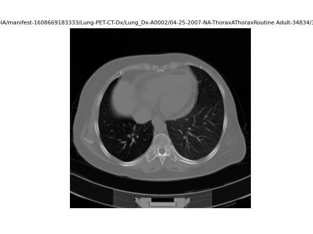
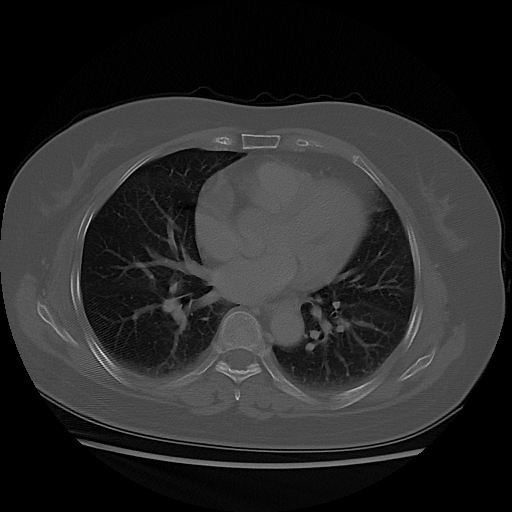
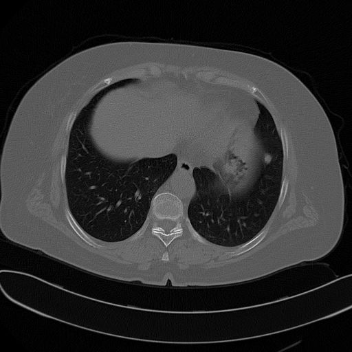
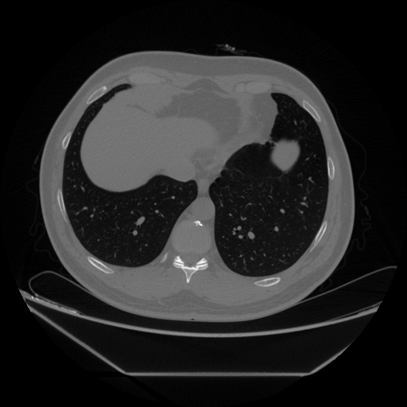

### Obtención de Datos para la GAN

Este documento describe el proceso de obtención, análisis y organización de datos para el desarrollo de una red generativa adversaria (GAN). Se basa en dos scripts principales: **data.py** (análisis de datos) y **generate-data.py** (creación de carpetas para clasificar imágenes aceptadas y descartadas).

---

### Datos

Los datos utilizados provienen de **The Cancer Imaging Archive (TCIA)**, específicamente del conjunto de imágenes de tomografías en formato DICOM denominado **Lung-PET-CT-Dx**.

---

### Probar el Código de data.py

1. **Descarga del Manifest**  
   - Descargue el archivo `.tcia` desde [Lung-PET-CT-Dx en TCIA](https://www.cancerimagingarchive.net/collection/lung-pet-ct-dx/).

2. **Uso de la Aplicación NBIA**  
   - Descargue la aplicación NBIA y abra el archivo `.tcia` para iniciar la descarga de las imágenes.

3. **Configuración del Directorio Base**  
   - En el script, defina la variable `base_dir` para apuntar a la carpeta donde se encuentra **Lung-PET-CT-Dx**.

4. **Gestión de Funciones**  
   - Comente o descomente las funciones según sea necesario. La variable `subject_folder` corresponde a la carpeta de un sujeto específico.

---

### Procesamiento de Datos

#### Obtención de Archivos DICOM
La función **`get_dicom_files()`** identifica los archivos DICOM y sus rutas.  
Ejemplo de salida:

```bash
Se encontraron 29,752 archivos DICOM.
Primeras 10 rutas:
../../../../ChestCT-NBIA/manifest-1608669183333/Lung-PET-CT-Dx/Lung_Dx-A0033/07-24-2008-NA-lungc-89277/3.000000-5mm Lung SS50-81295/1-42.dcm
...
```

Estas imágenes suelen corresponder a cortes de tomografías computarizadas (CT) de una misma región anatómica, organizadas por paciente y serie.

---

#### Visualización de Imágenes
La función **`show_dicom_images()`** permite generar un conjunto de 9 imágenes representativas a partir de los archivos DICOM.


---

### Metadatos

El programa genera un archivo **`metadata.csv`**, que contiene información relevante para cada sujeto. Por ejemplo:

| ID Único                                   | Colección          | Fecha      | Modalidad | Fabricante | Tamaño | Carpeta                                    |
|-------------------------------------------|--------------------|------------|-----------|------------|--------|--------------------------------------------|
| 1.3.6.1.4.1.14519...A0003 | Lung-PET-CT-Dx  | 07-07-2006 | CT        | SIEMENS    | 24 MB | ./Lung-PET-CT-Dx/Lung_Dx-A0003/... |

#### Estructura de Directorios
Cada sujeto tiene subcarpetas que organizan los estudios por fecha y tipo. Ejemplo para el sujeto **A0003**:

```bash
Lung_Dx-A0003
├── 07-07-2006-NA-ThoraxAThoraxRoutine Adult-24087
├── 07-21-2006-NA-Chest-84219
├── 07-25-2006-NA-Chest-37655
```

---

### Análisis de Imágenes y Estudios

Se analizan los diferentes estudios realizados para determinar qué imágenes son útiles para el entrenamiento del modelo:

1. **Criterios de Selección**  
   - Se acepta un subconjunto de estudios, como:
     - **Chest** (e.g., Lung_Dx-A0001)
     - **ThoraxAThoraxRoutine Adult** (e.g., Lung_Dx-A0002)

   - Se rechazan estudios con identificadores como:
     - **lungc** (e.g., Lung_Dx-A0019)
     - **5mm chest** (e.g., Lung_Dx-A0062)

2. **Corte Anatómico**  
   - Las imágenes seleccionadas deben corresponder a cortes superiores del tórax, visibles en referencia a ejemplos como:

   **Corte Correcto:**
   

   **Corte Incorrecto:**
   

---

### Métrica LPIPS para Selección de Imágenes

He creado un programa que tome una imágen de referencia y le aplique la métrica LISPS que utilizamos en la evaluación de la GAN (para evaluar la similitud perceptual de dos imágenes).

Imágenes de Referencia:





Ejemplo de salida:
```bash
Processed 1-42.png: LPIPS=0.2698
Processed 1-43.png: LPIPS=0.2760
Processed 1-41.png: LPIPS=0.2699
Processed 1-40.png: LPIPS=0.2691
```

**Criterio:**  
Imágenes con **LPIPS < 0.3600** se consideran útiles.

- **Imagen Inferior**  
  `1-01.dcm`: LPIPS = 0.4339  
- **Imagen Superior**  
  `1-13.dcm`: LPIPS = 0.3518  

---

### Filtrado Basado en Metadatos

Usando el archivo **`metadata.csv`**, se filtran los estudios de interés para optimizar el análisis (ya que no consideramos ciertos estudios).  
Ejemplo de valores únicos en `Study UID`:

```bash
Unique values in 'Study UID':
ThoraxAThoraxRoutine Adult
Chest
C-SP Chest
lungc
POS
LUNG
lungccc
CHEST
LUNGC
C-J
lung
LUNGCTA
chc
HeadBHeadSeq6MM Adult
CHC
CC
ch
5mm chest
HeadBHead6MM Adult
ABC
lung3D
cc
lungc GSI
Chest 3
e1 lung
Thorax01ThoraxRoutine Adult
Chest  3D IMR
Chest  3D
CH CH.3D
Chest 3D
chest.3d
chest
ch.3d ao.cta
```
Nota: El metadata.csv es el que se genera desde la aplicación NBIA, no ha sido modificado en ningún momento.

Solo se procesan los estudios aceptados para reducir ruido y optimizar el entrenamiento del modelo.

---

### **Script `generate-data.py`**  

Este script procesa imágenes médicas **DICOM**, las convierte a **PNG**, evalúa su similitud con una imagen de referencia mediante la métrica **LPIPS**, y las clasifica en dos carpetas:  

- **`Data-Transformed/`** → Si la similitud con la referencia es alta.  
- **`Discarded/`** → Si la similitud es baja.  

Para ejecutarlo, es necesario especificar:  
- **`path_NBIA_Data`** → Carpeta con los datos y `metadata.csv`.  
- **`reference_image_path`** → Imagen con la que se compararán los archivos.  
- **`transformed_dir`** y **`discarded_dir`** → Directorios de salida.  
- **`threshold`** → Umbral de similitud LPIPS (ej. `0.360`).  

El script analiza las imágenes, guarda los resultados en `lpips_results.csv` y optimiza los datos para el modelo.

---
Este proceso sistemático permite clasificar y organizar imágenes médicas de manera eficiente, asegurando la calidad de los datos utilizados para el entrenamiento de la GAN.