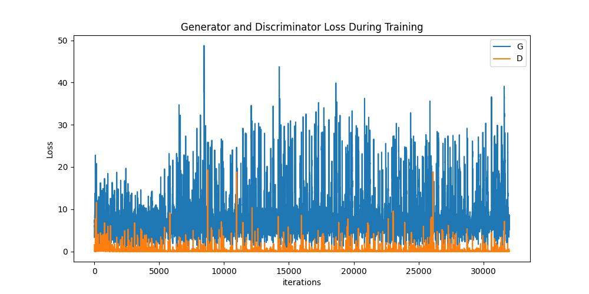
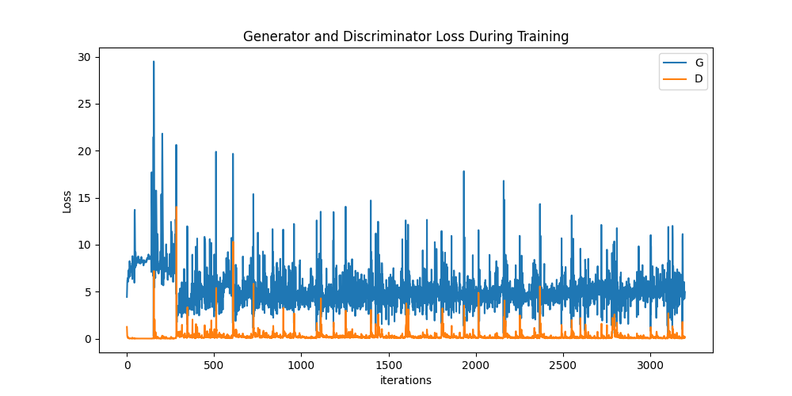
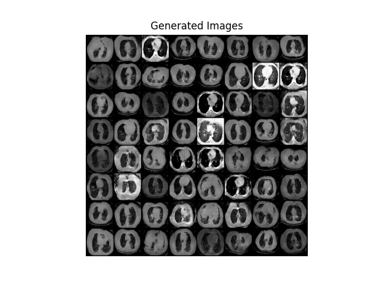
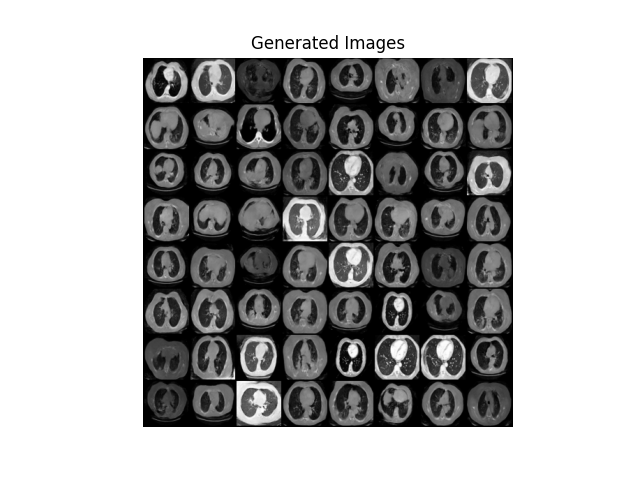
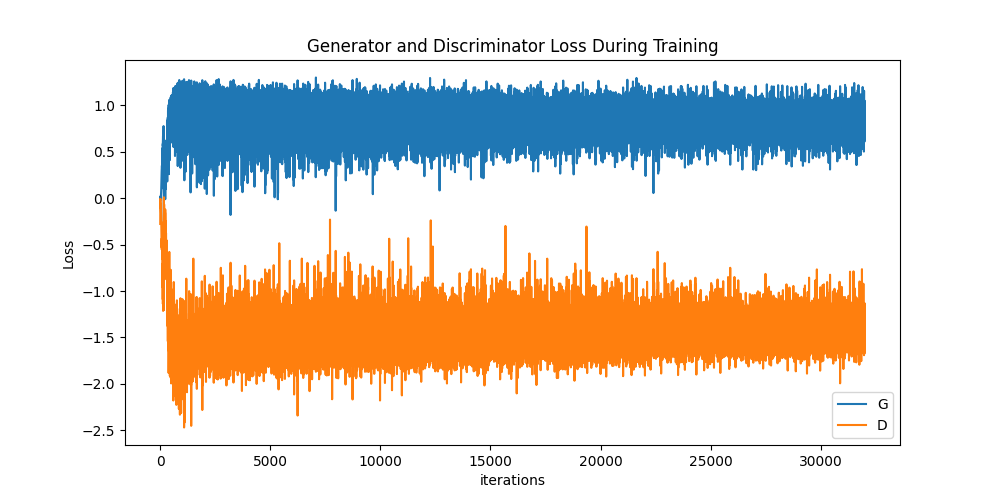
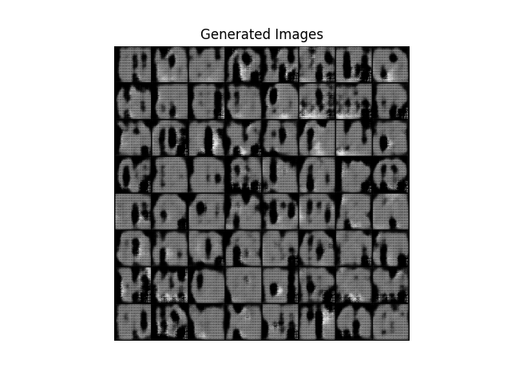
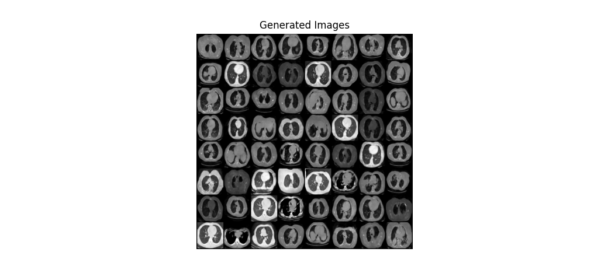

# ChestCT-GAN
Proyecto de fin de carrera: Generación de tomografías de pulmones con cáncer para generar datos sintéticos y mejorar los algoritmos de detección de cáncer

# Falta por escribir mucho

# Scripts 

### `generate.py`
Genera imágenes usando el modelo preentrenado `model_ChestCT.pth`.

#### Uso:
```bash
python generate.py
```

---

### `train.py`
Entrena el modelo usando los parámetros de `config.json`.

#### Uso:
```bash
python train.py
```

Las salidas del entrenamiento se guardan en un archivo llamado `training_log_wgan.csv` o `training_log_dcgan.csv`.

| Columna           | Descripción                                                                 |
|-------------------|-----------------------------------------------------------------------------|
| **Epoch**         | Número de la época durante el entrenamiento.                               |
| **Loss_D**        | Pérdida del discriminador; mide qué tan bien distingue entre imágenes reales y generadas. |
| **Loss_G**        | Pérdida del generador; mide qué tan bien engaña al discriminador.           |
| **D(x)**          | Probabilidad promedio asignada por el discriminador a imágenes reales.     |
| **D(G(z))_Real**  | Probabilidad promedio asignada a imágenes generadas clasificadas como reales. |
| **D(G(z))_Fake**  | Probabilidad promedio asignada a imágenes generadas clasificadas como falsas. |

Para visualizar un gráfico sobre la evolución de la pérdida del discriminador y generador, puedes ejecutar el siguiente comando:
```bash 
python graphLogs.py
```
---

### `eval_model.py`
Evalúa el modelo `model_ChestCT.pth` y muestra métricas como precisión del Discriminador, Generador, el SSMI (Índice de Similitud Estructural) y PSNR (Relación Señal a Ruido).

#### Uso:
```bash
python eval_model.py
```

Por defecto la ruta de carga del archivo "pth" es `{model_path}/model_ChestCT.pth` pero puedes poner otra:
```bash
python generate.py -load_path ..\..\model\model_wgan\model_epoch_990.pth
```

A

#### Ejemplo de salida:
```bash
------------------------------
   Model Evaluation Results
------------------------------
Discriminator Accuracy: 47.25%
Generator Accuracy:  3.00%
------------------------------
------------------------------
SSIM Score:          0.1081
------------------------------
PSNR Score:          10.14 dB
------------------------------
```

- **SSIM (Índice de Similitud Estructural):** 0.1081 (valores bajos indican *baja* similitud estructural)
- **PSNR (Relación Señal a Ruido):** 10.14 dB (valores bajos sugieren calidad visual *reducida*)

### Valores ideales:
```bash
------------------------------
   Model Evaluation Results
------------------------------
Discriminator Accuracy: > 90% 
Generator Accuracy:  > 90% 
------------------------------
------------------------------
SSIM Score:          1.0 
------------------------------
PSNR Score:          >= 40 dB 
------------------------------

```

---

## Progreso
**DC-GAN**
- Con hiperparámetros comunes: 

- Con ajuste de hiperparámetros
    + Reducción de la tasa de aprendizaje a 0.001
    + Aumento de ngf de 64 a 128 (número de filtros del generador, aumenta la capacidad de capturar características más complejas)
    + Aumento de ndf de 64 a 128 (número de filtros del Discriminador)


Ejemplo de imágenes en el epoch **90**:


Ejemplo de imágenes en el epoch **990**:

```bash
------------------------------
   Model Evaluation Results
------------------------------
Discriminator Accuracy: 47.45%
Generator Accuracy:  10.00%
------------------------------
------------------------------
SSIM Score:          0.1020
------------------------------
PSNR Score:          10.41 dB
------------------------------
```
Nota: 1000 epochs ha tardado unas 14h horas. 


**WGAN**
- Con ajuste de hiperparámetros




Ejemplo de imágenes en el epoch **90**:




Ejemplo de imágenes en el epoch **990**:



```bash
------------------------------
   Model Evaluation Results
------------------------------
Discriminator Accuracy: 41.15%
Generator Accuracy:  3.00%
------------------------------
------------------------------
SSIM Score:          0.1144
------------------------------
PSNR Score:          10.42 dB
------------------------------
```

Nota: 1000 epochs ha tardado unas 26 horas. 
