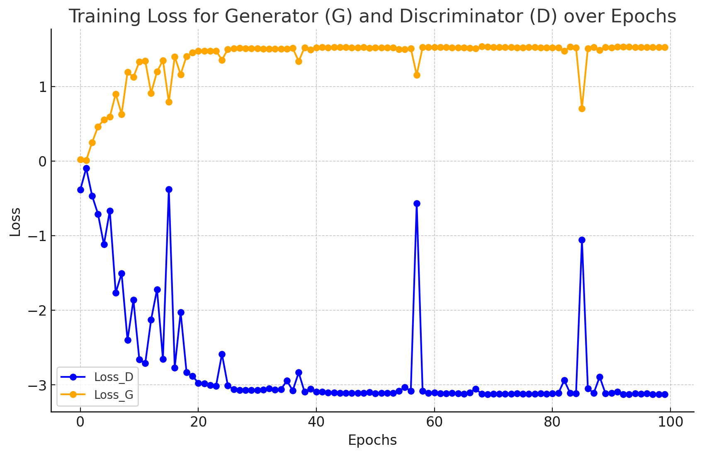

# ChestCT-GAN
Proyecto de fin de carrera: Generación de tomografías de pulmones con cáncer para generar datos sintéticos y mejorar los algoritmos de detección de cáncer

# Falta por escribir mucho

# Scripts 

### `generate.py`
Genera imágenes usando el modelo preentrenado `model_ChestCT.pth`.

#### Uso:
```bash
python generate.py
```

---

### `train.py`
Entrena el modelo usando los parámetros de `config.json`.

#### Uso:
```bash
python train.py
```

---

### `eval_model.py`
Evalúa el modelo `model_ChestCT.pth` y muestra métricas como precisión del Discriminador, Generador e Inception Score.

#### Uso:
```bash
python eval_model.py
```

#### Ejemplo de salida:
```bash
------------------------------
   Model Evaluation Results
------------------------------
Discriminator Accuracy: 47.00%
Generator Accuracy:  4.00%
------------------------------
------------------------------
       Inception Score
------------------------------
Score:               2.3015
------------------------------
```

---

## Progreso
**DC-GAN**
- Con hiperparámetros comunes: 

- Con ajuste de hiperparámetros
    + Reducción de la tasa de aprendizaje a 0.001
    + Aumento de ngf de 64 a 128 (número de filtros del generador, aumenta la capacidad de capturar características más complejas)
    + Aumento de ndf de 64 a 128 (número de filtros del Discriminador)


Ejemplo de imágenes en el epoch **90**:


**WGAN**
- Con ajuste de hiperparámetros

Ejemplo de imágenes en el epoch **90**:

