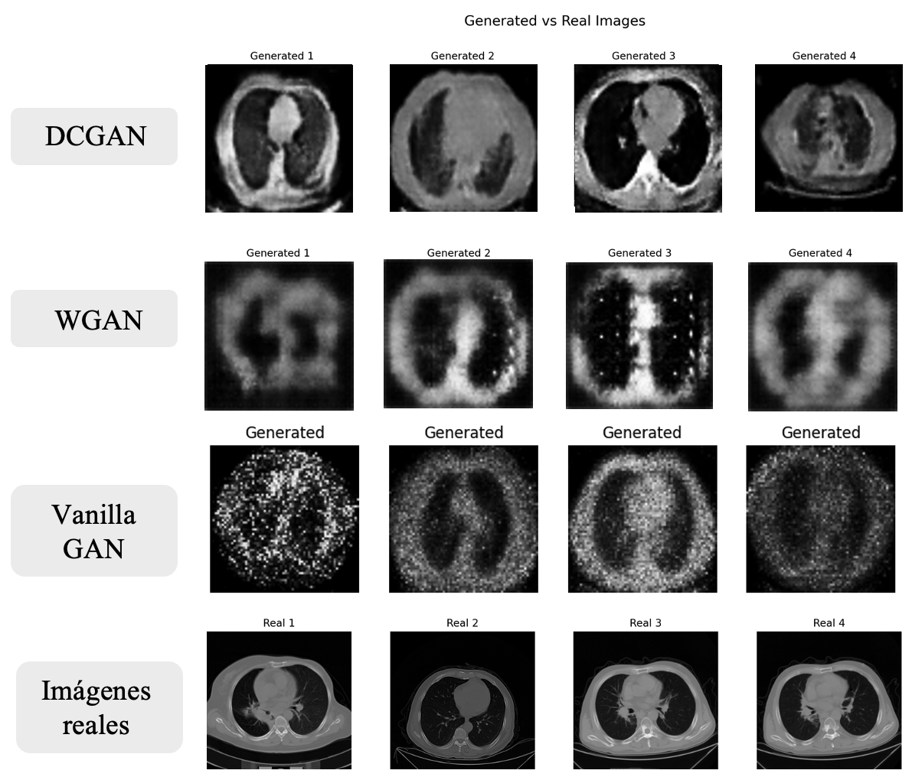
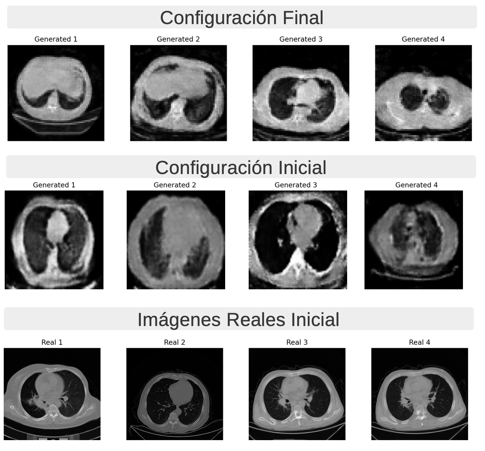

# Generación de Imágenes Sintéticas de Tomografías Computarizadas de Pulmones con Cáncer con una GAN

> Note: This document is also available in **English** [here](#synthetic-image-generation-of-lung-ct-scans-with-cancer-using-a-gan).


Este repositorio contiene el código y la documentación del Trabajo de Fin de Grado (TFG) de Paloma Pérez de Madrid. El proyecto se centra en la generación de imágenes sintéticas de tomografías computarizadas de pulmones con cáncer mediante una Red Generativa Antagónica (GAN). 


<center> <em> Arquitectura de la DCGAN (Feng et al., 2024)</em> </center>

## Estructura del Repositorio

```
.
├── Arquitecturas-de-prueba   # Tres arquitecturas evaluadas para seleccionar la DCGAN
├── README.md                 
├── X-Ray-pneumonia           # Anexo sobre la generación de radiografías con neumonía
├── doc                       # Documentación adicional
├── img                       # Imágenes de referencia y ejemplos generados
└── src                       # Código fuente del proyecto
    ├── pipeline              # Implementación del pipeline de MLOps con Metaflow
    └── interfazChestGAN      # Interfaz de usuario en Node.js
```

## Descripción del Proyecto
Este proyecto busca generar imágenes médicas sintéticas para ayudar en el entrenamiento de modelos de detección de cáncer de pulmón. Se emplea una arquitectura GAN optimizada para la creación de tomografías computarizadas sintéticas, con un enfoque en la aplicabilidad en entornos médicos y de investigación.

## Tecnologías Utilizadas
- **PyTorch** para la implementación de la GAN
- **Metaflow** para la gestión del pipeline de MLOps
- **Node.js** para el desarrollo de la interfaz de usuario

## Requisitos Previos
Para ejecutar correctamente el proyecto, asegúrate de tener instaladas las siguientes herramientas y versiones:
- Node.js (preferiblemente versión 16 o superior)
- Python 3.11 
- PyTorch


## Instalación y Uso

1. Clona el repositorio:
   ```bash
   git clone https://github.com/PPerezdeMadrid/ChestCT-GAN
   ```
2. Instala las dependencias necesarias:
   ```bash
   cd src/pipeline
   pip install -r requirements.txt
   ```
   ```bash
   cd src/interfazChestGAN
   npm install
   ```
3. Ejecución del sistema:
   - Para ejecutar la interfaz de usuario en un servidor local:
     ```bash
     cd src/interfazChestGAN
     npm start
     ```
   - Para ejecutar el pipeline de entrenamiento en un entorno local:
     ```bash
     cd src/pipeline
     python main_pipeline.py run
     ```
   - En la demostración final, la interfaz se ejecutará en una instancia **EC2 de AWS**, y el pipeline en un **clúster de Kubernetes**. Ambas funciones pueden ejecutarse de manera independiente.

   > Para hacerlo de forma automática puede utilizar el script `setup_and_run` que inicializará la interfaz en `http://127.0.0.1:8080` y a su vez se descargará el conjunto de datos e inicializará el pipeline. (Sólo para linux)
   > Python 3.11 debe estar instalado y accesible como python3.11 en el PATH.

## Fuentes de Datos
Los datos de entrenamiento utilizados en este proyecto provienen de las siguientes fuentes:

- **Lung-PET-CT-Dx**:  
  Li, P., Wang, S., Li, T., Lu, J., HuangFu, Y., & Wang, D. (2020).  
  *A Large-Scale CT and PET/CT Dataset for Lung Cancer Diagnosis (Lung-PET-CT-Dx) [Data set].*  
  The Cancer Imaging Archive. https://doi.org/10.7937/TCIA.2020.NNC2-0461  

- **Chest CT Scan Images (Kaggle)**:  
  https://www.kaggle.com/datasets/mohamedhanyyy/chest-ctscan-images  

Se han seguido las **políticas de uso de datos y citación** requeridas por cada fuente.

## Resultados

A continuación, se presentan los principales resultados obtenidos durante el entrenamiento y evaluación del modelo generativo. Se comparan arquitecturas, se muestra la mejora tras el ajuste de hiperparámetros y se incluyen ejemplos de imágenes sintéticas generadas.


### Comparación entre arquitecturas
  
Comparativa visual entre los resultados generados por diferentes arquitecturas GAN implementadas.

### Evaluación comparativa
  
Métricas de evaluación y análisis comparativo del rendimiento de los modelos.

### Mejora tras ajuste de hiperparámetros
  
Resultado del modelo con la configuración inicial frente a la versión final tras el ajuste de hiperparámetros.

### Generación de radiografías con neumonía (anexo)
  
Animación con ejemplos de imágenes generadas a partir de radiografías con neumonía utilizando DCGAN (proyecto anexo).


## Contacto
Para más información, puedes contactarme a través de mi perfil de GitHub.

--- 
---

# Synthetic Image Generation of Lung CT Scans with Cancer Using a GAN

This repository contains the code and documentation for the Bachelor's Thesis (TFG) of Paloma Pérez de Madrid. The project focuses on generating synthetic lung computed tomography (CT) images with cancer using a Generative Adversarial Network (GAN).


<center> <em> DCGAN architecture (Feng et al., 2024) </em> </center>

## Repository Structure

```
.
├── Arquitecturas-de-prueba   # Three evaluated architectures before selecting the DCGAN
├── README.md                 
├── X-Ray-pneumonia           # Annex on pneumonia X-ray image generation
├── doc                       # Additional documentation
├── img                       # Reference and sample generated images
└── src                       # Project source code
    ├── pipeline              # MLOps pipeline implemented with Metaflow
    └── interfazChestGAN      # User interface built with Node.js
```

## Project Description

This project aims to generate synthetic medical images to support the training of lung cancer detection models. It uses a GAN architecture optimized for the generation of synthetic CT scans, with a focus on applicability in clinical and research environments.

## Technologies Used

* **PyTorch** for GAN implementation
* **Metaflow** for managing the MLOps pipeline
* **Node.js** for developing the user interface

## Prerequisites
To successfully run the project, make sure you have the following tools and versions installed:
- Node.js (preferably version 16 or higher)
- Python 3.11 
- PyTorch

## Installation and Usage

1. Clone the repository:

   ```bash
   git clone https://github.com/PPerezdeMadrid/ChestCT-GAN
   ```

2. Install the required dependencies:

   ```bash
   cd src/pipeline
   pip install -r requirements.txt
   ```

   ```bash
   cd src/interfazChestGAN
   npm install
   ```

3. Run the system:

   * To run the user interface on a local server:

     ```bash
     cd src/interfazChestGAN
     npm start
     ```

   * To run the training pipeline locally:

     ```bash
     cd src/pipeline
     python main_pipeline.py
     ```

    > To do this automatically, you can use the `setup_and_run` script, which will launch the interface at `http://127.0.0.1:8080`, download the dataset, and initialize the pipeline. (Only for linux). Python 3.11 must be installed and accessible as python3.11 in the PATH.

   * In the final demonstration, the interface will be deployed on an **AWS EC2 instance**, and the pipeline will run on a **Kubernetes cluster**. Both components can operate independently.

## Data Sources

The training data used in this project comes from the following sources:

* **Lung-PET-CT-Dx**:
  Li, P., Wang, S., Li, T., Lu, J., HuangFu, Y., & Wang, D. (2020).
  *A Large-Scale CT and PET/CT Dataset for Lung Cancer Diagnosis (Lung-PET-CT-Dx) \[Data set].*
  The Cancer Imaging Archive. [https://doi.org/10.7937/TCIA.2020.NNC2-0461](https://doi.org/10.7937/TCIA.2020.NNC2-0461)

* **Chest CT Scan Images (Kaggle)**:
  [https://www.kaggle.com/datasets/mohamedhanyyy/chest-ctscan-images](https://www.kaggle.com/datasets/mohamedhanyyy/chest-ctscan-images)

All datasets have been used in accordance with their **usage and citation policies**.

## Results

## Results

Below are the main results obtained during the training and evaluation of the generative model. Architectures are compared, improvements after hyperparameter tuning are shown, and examples of synthetic images generated are included.

### Architecture Comparison
  
Visual comparison of the results generated by different implemented GAN architectures.

### Comparative Evaluation
  
Evaluation metrics and comparative analysis of model performance.

### Improvement After Hyperparameter Tuning
  
Model results with the initial configuration versus the final version after hyperparameter tuning.


### Generation of Pneumonia X-Ray Images (Appendix)
  
Animation showing examples of images generated from pneumonia X-rays using DCGAN (appendix project).


## Contact

For more information, feel free to contact me via my GitHub profile.


