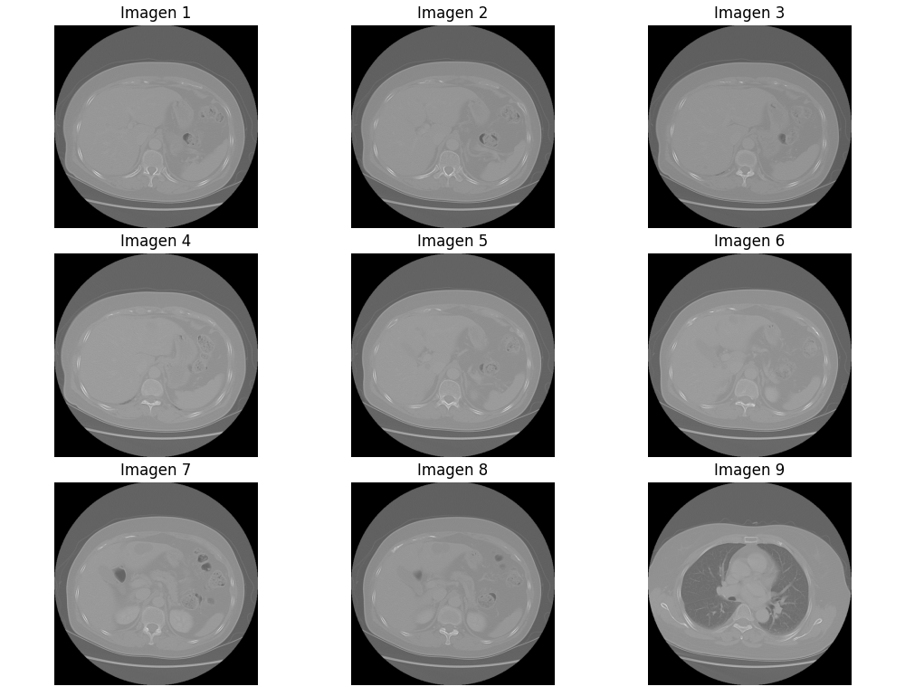

# Data Acquisition for the GAN

This document describes the process of acquiring, analyzing, and organizing data for the development of a Generative Adversarial Network (GAN). It is based on two main scripts: **data.py** (data analysis) and **generateData.py** (creation of folders to classify accepted and discarded images).

## Data

The data used comes from **The Cancer Imaging Archive (TCIA)**, specifically from the set of CT scan images in DICOM format named **Lung-PET-CT-Dx**.

---

## Testing the data.py Code

If the `NBIA_download.py` file does not work, the files can be downloaded as follows:

1. **Download the Manifest**  
   - Download the `.tcia` file from [Lung-PET-CT-Dx on TCIA](https://www.cancerimagingarchive.net/collection/lung-pet-ct-dx/).

2. **Using the NBIA Application**  
   - Download the NBIA application and open the `.tcia` file to start downloading the images.

3. **Setting the Base Directory**  
   - In the script, set the `base_dir` variable to point to the folder where **Lung-PET-CT-Dx** is located.

4. **Managing Functions**  
   - Comment or uncomment the functions as needed. The `subject_folder` variable corresponds to a specific subject's folder.

---

### Data Processing

#### Obtaining DICOM Files
The **`get_dicom_files()`** function identifies the DICOM files and their paths.  
Example output:

```bash
29,752 DICOM files found.
First 10 paths:
../../../../ChestCT-NBIA/manifest-1608669183333/Lung-PET-CT-Dx/Lung_Dx-A0033/07-24-2008-NA-lungc-89277/3.000000-5mm Lung SS50-81295/1-42.dcm
...
```

These images typically correspond to CT scan slices of the same anatomical region, organized by patient and series.

---

#### Image Visualization

The **`show_dicom_images()`** function generates a set of 9 representative images from the DICOM files.



---

### Metadata

The program generates a **`metadata.csv`** file containing relevant information for each subject. For example:

| Unique ID                 | Collection     | Date       | Modality | Manufacturer | Size  | Folder                              |
| ------------------------- | -------------- | ---------- | -------- | ------------ | ----- | ----------------------------------- |
| 1.3.6.1.4.1.14519...A0003 | Lung-PET-CT-Dx | 07-07-2006 | CT       | SIEMENS      | 24 MB | ./Lung-PET-CT-Dx/Lung\_Dx-A0003/... |

#### Directory Structure

Each subject has subfolders organizing studies by date and type. Example for subject **A0003**:

```bash
Lung_Dx-A0003
├── 07-07-2006-NA-ThoraxAThoraxRoutine Adult-24087
├── 07-21-2006-NA-Chest-84219
├── 07-25-2006-NA-Chest-37655
```

---

### Image and Study Analysis

The different studies are analyzed to determine which images are useful for model training:

1. **Selection Criteria**

   * A subset of studies is accepted, such as:

     * **Chest** (e.g., Lung\_Dx-A0001)
     * **ThoraxAThoraxRoutine Adult** (e.g., Lung\_Dx-A0002)

   * Studies with identifiers such as the following are rejected:

     * **lungc** (e.g., Lung\_Dx-A0019)
     * **5mm chest** (e.g., Lung\_Dx-A0062)

2. **Anatomical Slice**

   * Selected images must correspond to upper chest slices, visible with reference to examples such as:

   **Correct Slice:**
   

   **Incorrect Slice:**
   

---

### PSNR and LPIPS Metrics for Image Selection

Two metrics are used in this project to assess image quality and similarity with reference images: **PSNR (Peak Signal-to-Noise Ratio)** and **LPIPS (Learned Perceptual Image Patch Similarity)**. **PSNR** takes precedence over **LPIPS** in the image classification process.

The workflow is as follows:

1. **Evaluation with PSNR**

   * PSNR is calculated between the generated image and the reference image. If the image’s **PSNR** exceeds the specified threshold (e.g., **30 dB**), the image moves to the next evaluation stage.

2. **Evaluation with LPIPS**

   * If the image passes the PSNR threshold, its LPIPS value is then calculated. If **LPIPS** is below a specified threshold (e.g., **0.3500**), the image is considered acceptable.

**Evaluation Criteria:**

* **PSNR**: An image is considered useful if PSNR exceeds the defined threshold. For example, a PSNR above **30 dB** indicates a good-quality image.
* **LPIPS**: Only evaluated if PSNR passes the threshold. If LPIPS is **< 0.3500**, the image is considered useful.

#### Example:

* **Low-Quality Image**
  `1-01.dcm`: PSNR = 11.23 dB, LPIPS = 0.4339 → Discarded due to low PSNR.

* **High-Quality Image**
  `1-13.dcm`: PSNR = 16.1 dB, LPIPS = 0.3518 → Kept due to moderate PSNR.

This approach ensures that poor-quality images are first discarded using the PSNR metric, and only those passing the PSNR threshold are evaluated with LPIPS for finer assessment.

---

### Filtering Based on Metadata

Using the **`metadata.csv`** file, studies of interest are filtered to optimize analysis (since certain studies are not considered).
Example of unique values in `Study UID`:

```bash
Unique values in 'Study UID':
ThoraxAThoraxRoutine Adult
Chest
C-SP Chest
lungc
POS
LUNG
lungccc
CHEST
LUNGC
C-J
lung
LUNGCTA
chc
HeadBHeadSeq6MM Adult
CHC
CC
ch
5mm chest
HeadBHead6MM Adult
ABC
lung3D
cc
lungc GSI
Chest 3
e1 lung
Thorax01ThoraxRoutine Adult
Chest  3D IMR
Chest  3D
CH CH.3D
Chest 3D
chest.3d
ch
ch.3d ao.cta
```

Note: The `metadata.csv` is generated by the NBIA application and has not been modified.

Only accepted studies are processed to reduce noise and optimize model training.

---

### **Script `generateData.py`**

This script processes medical **DICOM** images, converts them to **PNG**, evaluates their similarity to a reference image using **PSNR** and **LPIPS**, and classifies them into two folders. Finally, it loops through the folder of images to be used for brightness adjustment:

* **`Data-Transformed/`** → If the similarity to the reference is high.
* **`Data-Discarded/`** → If the similarity is low.

To run it, you need to specify:

* **`path_NBIA_Data`** → Folder with the data and `metadata.csv`.
* **`reference_image_path`** → Image to be compared against the files.
* **`transformed_dir`** and **`discarded_dir`** → Output directories.
* **`psnr_threshold`** → PSNR threshold (e.g., `15`).
* **`lpips_threshold`** → LPIPS threshold (e.g., `0.350`).

The script analyzes the images, saves the results in `lpips_psnr_results.csv`, and optimizes the data for the model.

---

This systematic process allows for efficient classification and organization of medical images, ensuring the quality of the data used to train the GAN.

# Results


### Script: `generateDataQuality.py`

This script processes DICOM images, converts them to PNG format, and calculates the similarity between transformed images and reference images using **PSNR**. If the PSNR between a transformed image and a reference image exceeds a specific threshold, the image is discarded and moved to the "discarded" folder. If not, it is saved in the "transformed" folder. Additionally, before processing, 15% of the images at both the beginning and end of each DICOM file set are discarded, removing low-quality or extreme images that could interfere with analysis.

### When to Use Each One?

1. **`generateData.py`**:

   * **When to use it**: When the number of images is more important than their quality.
   * **What does it do?**: It includes both lower and upper slices (extremes), resulting in a much larger image volume. It’s useful when you have enough computing power to train the GAN with a large dataset.

 2. **`generateDataQuality.py`**
   - **When to use it**: When you have limited computational resources and prefer to train the model with a smaller number of higher-quality images.
   - **What it does**: This script focuses on removing incorrect slices (typically the extreme top and bottom parts of the scan), ensuring that the processed images are more accurate and suitable for classification algorithms. This improves the overall quality of the dataset used for training.

#### Images from Patient A001


As shown in this patient's scan, the first images correspond to lower slices and the last to upper slices. After several tests and analyses, it has been determined that the optimal percentage for removing undesired slices is 15%. However, this value is indicative and can be adjusted depending on the desired quality and size of the dataset.