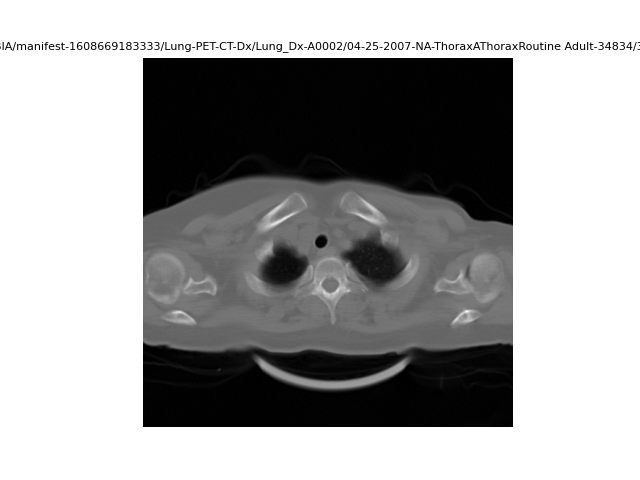
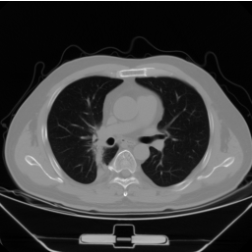
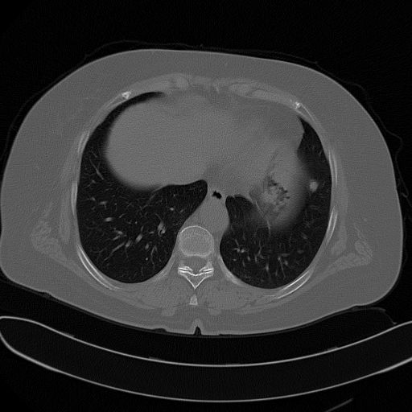
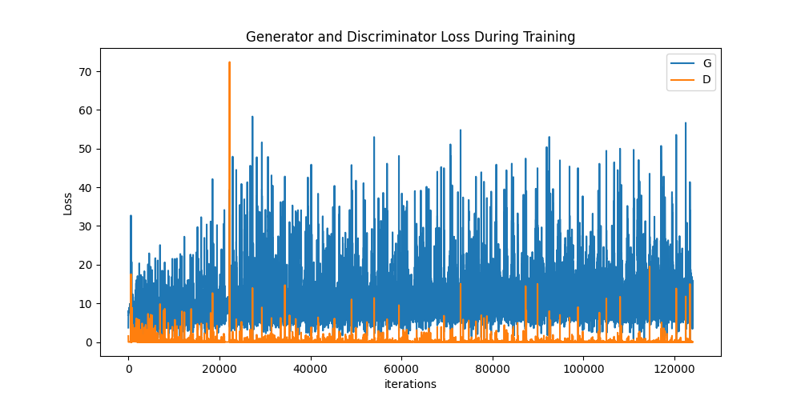
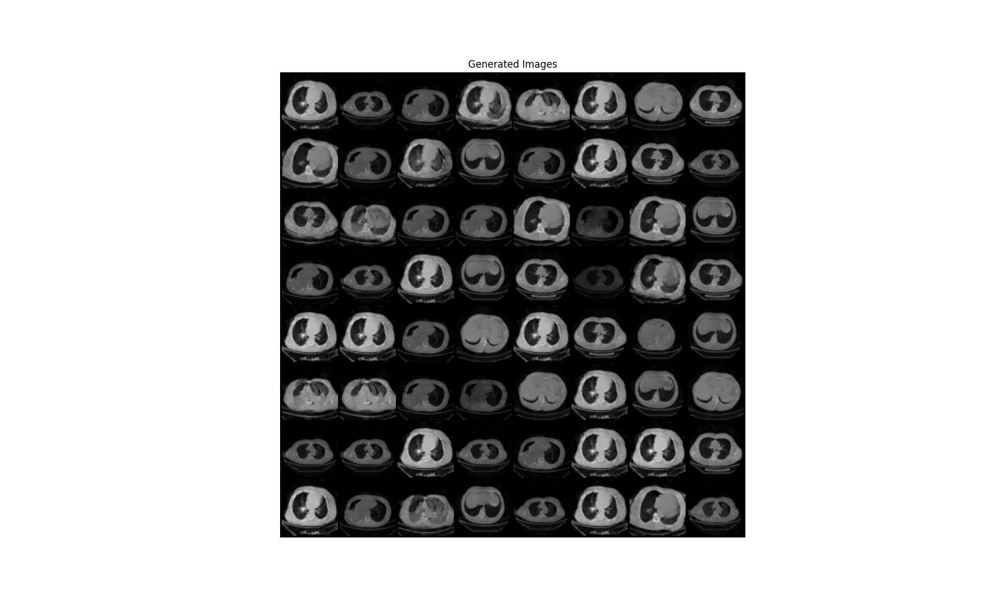

### Obtención de Datos para la GAN

Este documento describe el proceso de obtención, análisis y organización de datos para el desarrollo de una red generativa adversaria (GAN). Se basa en dos scripts principales: **data.py** (análisis de datos) y **generateData.py** (creación de carpetas para clasificar imágenes aceptadas y descartadas).

---

### Datos

Los datos utilizados provienen de **The Cancer Imaging Archive (TCIA)**, específicamente del conjunto de imágenes de tomografías en formato DICOM denominado **Lung-PET-CT-Dx**.

---

### Probar el Código de data.py

En caso de que no funcione el archivo `NBIA_download.py` puede descargarse los archivos de la siguiente forma:

1. **Descarga del Manifest**  
   - Descargue el archivo `.tcia` desde [Lung-PET-CT-Dx en TCIA](https://www.cancerimagingarchive.net/collection/lung-pet-ct-dx/).

2. **Uso de la Aplicación NBIA**  
   - Descargue la aplicación NBIA y abra el archivo `.tcia` para iniciar la descarga de las imágenes.

3. **Configuración del Directorio Base**  
   - En el script, defina la variable `base_dir` para apuntar a la carpeta donde se encuentra **Lung-PET-CT-Dx**.

4. **Gestión de Funciones**  
   - Comente o descomente las funciones según sea necesario. La variable `subject_folder` corresponde a la carpeta de un sujeto específico.

---

### Procesamiento de Datos

#### Obtención de Archivos DICOM
La función **`get_dicom_files()`** identifica los archivos DICOM y sus rutas.  
Ejemplo de salida:

```bash
Se encontraron 29,752 archivos DICOM.
Primeras 10 rutas:
../../../../ChestCT-NBIA/manifest-1608669183333/Lung-PET-CT-Dx/Lung_Dx-A0033/07-24-2008-NA-lungc-89277/3.000000-5mm Lung SS50-81295/1-42.dcm
...
```

Estas imágenes suelen corresponder a cortes de tomografías computarizadas (CT) de una misma región anatómica, organizadas por paciente y serie.

---

#### Visualización de Imágenes
La función **`show_dicom_images()`** permite generar un conjunto de 9 imágenes representativas a partir de los archivos DICOM.


---

### Metadatos

El programa genera un archivo **`metadata.csv`**, que contiene información relevante para cada sujeto. Por ejemplo:

| ID Único                                   | Colección          | Fecha      | Modalidad | Fabricante | Tamaño | Carpeta                                    |
|-------------------------------------------|--------------------|------------|-----------|------------|--------|--------------------------------------------|
| 1.3.6.1.4.1.14519...A0003 | Lung-PET-CT-Dx  | 07-07-2006 | CT        | SIEMENS    | 24 MB | ./Lung-PET-CT-Dx/Lung_Dx-A0003/... |

#### Estructura de Directorios
Cada sujeto tiene subcarpetas que organizan los estudios por fecha y tipo. Ejemplo para el sujeto **A0003**:

```bash
Lung_Dx-A0003
├── 07-07-2006-NA-ThoraxAThoraxRoutine Adult-24087
├── 07-21-2006-NA-Chest-84219
├── 07-25-2006-NA-Chest-37655
```

---

### Análisis de Imágenes y Estudios

Se analizan los diferentes estudios realizados para determinar qué imágenes son útiles para el entrenamiento del modelo:

1. **Criterios de Selección**  
   - Se acepta un subconjunto de estudios, como:
     - **Chest** (e.g., Lung_Dx-A0001)
     - **ThoraxAThoraxRoutine Adult** (e.g., Lung_Dx-A0002)

   - Se rechazan estudios con identificadores como:
     - **lungc** (e.g., Lung_Dx-A0019)
     - **5mm chest** (e.g., Lung_Dx-A0062)

2. **Corte Anatómico**  
   - Las imágenes seleccionadas deben corresponder a cortes superiores del tórax, visibles en referencia a ejemplos como:

   **Corte Correcto:**
   

   **Corte Incorrecto:**
   

---

### Métrica LPIPS y SSMI para Selección de Imágenes

He creado un programa que tome varias imágenes de referencia y les aplique tanto la métrica LISPS que utilizamos en la evaluación de la GAN (para evaluar la similitud perceptual de dos imágenes) como SSMI. El objetivo es seleccionar automáticamente las imágenes generadas más similares a las de referencia buena, descartando aquellas que se asemejen a un conjunto definido de referencias negativas.

Imágenes de Referencia:




Imágenes de Referencia para descartar:


Nota: el programa solo mostrará una barra de progreso hasta que finalice la extracción. 

**Criterio:**  
Imágenes con **LPIPS < 0.3500** se consideran útiles.

- **Imagen Inferior**  
  `1-01.dcm`: LPIPS = 0.4339  
- **Imagen Superior**  
  `1-13.dcm`: LPIPS = 0.3518  

Para la métrica SSIM, es más adecuado seleccionar imágenes cuyos valores se encuentren entre 0.5 y 0 cuando el objetivo es filtrar por diferencias estructurales.

Los valores cercanos o superiores a 0.5 indican una similitud moderada con respecto a la imagen de referencia, lo cual puede ser útil si se desea mantener cierto parecido sin perder diversidad.

Por otro lado, valores menores a 0 reflejan que la imagen es estructuralmente muy diferente, y en la práctica pueden estar causados por contrastes extremos, inversión de intensidades, o ruido.

Por tanto, si se busca un dataset más pequeño pero con imágenes más relevantes, es recomendable utilizar un umbral cercano a 0.5. En cambio, si se prioriza tener más volumen, se puede optar por un umbral más bajo (más cercano a 0).

---

### Filtrado Basado en Metadatos

Usando el archivo **`metadata.csv`**, se filtran los estudios de interés para optimizar el análisis (ya que no consideramos ciertos estudios).  
Ejemplo de valores únicos en `Study UID`:

```bash
Unique values in 'Study UID':
ThoraxAThoraxRoutine Adult
Chest
C-SP Chest
lungc
POS
LUNG
lungccc
CHEST
LUNGC
C-J
lung
LUNGCTA
chc
HeadBHeadSeq6MM Adult
CHC
CC
ch
5mm chest
HeadBHead6MM Adult
ABC
lung3D
cc
lungc GSI
Chest 3
e1 lung
Thorax01ThoraxRoutine Adult
Chest  3D IMR
Chest  3D
CH CH.3D
Chest 3D
chest.3d
chest
ch.3d ao.cta
```
Nota: El metadata.csv es el que se genera desde la aplicación NBIA, no ha sido modificado en ningún momento.

Solo se procesan los estudios aceptados para reducir ruido y optimizar el entrenamiento del modelo.

---

### **Script `generateData.py`**  

Este script procesa imágenes médicas **DICOM**, las convierte a **PNG**, evalúa su similitud con una imagen de referencia mediante la métrica **LPIPS**, y las clasifica en dos carpetas. Finalmente, recorre la carpeta de las imágenes que serán utilizadas para ajustar el brillo:  

- **`Data-Transformed/`** → Si la similitud con la referencia es alta.  
- **`Data-Discarded/`** → Si la similitud es baja.  

Para ejecutarlo, es necesario especificar:  
- **`path_NBIA_Data`** → Carpeta con los datos y `metadata.csv`.  
- **`reference_image_path`** → Imagen con la que se compararán los archivos.  
- **`transformed_dir`** y **`discarded_dir`** → Directorios de salida.  
- **`threshold`** → Umbral de similitud LPIPS (ej. `0.360`).  

El script analiza las imágenes, guarda los resultados en `lpips_results.csv` y optimiza los datos para el modelo.

---
Este proceso sistemático permite clasificar y organizar imágenes médicas de manera eficiente, asegurando la calidad de los datos utilizados para el entrenamiento de la GAN.

# Resultados




### Script: `generateData2.py`

Este script procesa imágenes DICOM, las convierte a formato PNG y calcula la similitud entre las imágenes transformadas y las imágenes de referencia utilizando el PSNR (Peak Signal-to-Noise Ratio). Si el PSNR entre una imagen transformada y una imagen de referencia es mayor que un umbral específico, la imagen se descarta y se mueve a la carpeta de "descartadas". Si no, se guarda en la carpeta de "transformadas". Además, antes de realizar el procesamiento, se descarta un 15% de las imágenes tanto al principio como al final de cada conjunto de archivos DICOM, eliminando imágenes de mala calidad o extremas que podrían interferir con el análisis.

### ¿Cuándo usar cada uno?

1. **`generateData.py`**:  
   - **Cuándo usarlo**: Cuando la cantidad de imágenes es más importante que la calidad.  
   - **¿Qué hace?**: Encontrarás imágenes con cortes inferiores y superiores (extremos), pero tendrás un volumen de imágenes mucho mayor. Es útil cuando tienes capacidad computacional suficiente para entrenar la GAN con una gran cantidad de datos.

2. **`generateDataQuality.py`**:  
   - **Cuándo usarlo**: Si no cuentas con mucha capacidad computacional y prefieres entrenar el modelo con un número menor de imágenes pero de mayor calidad.  
   - **¿Qué hace?**: Este script se enfoca en eliminar los cortes incorrectos (los extremos de las imágenes), asegurando que las imágenes procesadas sean más precisas y adecuadas para algoritmos de clasificación, lo que mejora la calidad de las imágenes utilizadas en el entrenamiento.

#### Imágenes del Paciente A001


Tal y como se observa en el escáner de este paciente, las primeras imágenes corresponden a cortes inferiores y las últimas a cortes superiores. Tras realizar varias pruebas y análisis, se ha determinado que el porcentaje más óptimo para descartar las imágenes de corte inferior y superior es del **15%**. Esto ayuda a eliminar las imágenes extremas que podrían no ser representativas para el análisis, asegurando que solo las imágenes más relevantes y representativas sean utilizadas en el procesamiento posterior.


