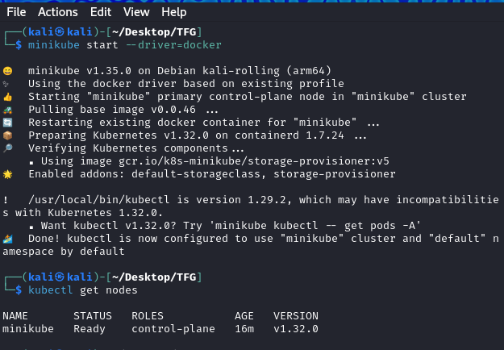

# Orquestración de Metaflow con Kubernetes y MiniKube

### ✅ **1. Verificar arquitectura**
Primero, confirma que tienes una arquitectura ARM en Ubuntu:

```bash
uname -m
```

En mi caso `aarch64`, estás en **ARM64**.

---

### 📦 **2. Instalar Docker en Ubuntu ARM**
1. Elimina versiones antiguas (si las tienes):

```bash
sudo apt-get remove docker docker-engine docker.io containerd runc
```

2. Instala Docker:

```bash
sudo apt-get update
sudo apt-get install -y docker.io
```

3. Verifica la instalación:

```bash
docker --version
```

Asegúrate de agregar tu usuario al grupo `docker`:

```bash
sudo usermod -aG docker $USER
newgrp docker
```

---

### 🚀 **3. Instalar Minikube en Ubuntu ARM**
1. Descarga la versión ARM de **Minikube**:

```bash
curl -LO https://storage.googleapis.com/minikube/releases/latest/minikube-linux-arm64
sudo install minikube-linux-arm64 /usr/local/bin/minikube
```

2. Verifica la instalación:

```bash
minikube version
```

---

### 🛠️ **4. Iniciar el clúster en ARM**
En ARM, usa el driver `docker` o `qemu` para arrancar Minikube:

```bash
minikube start --driver=docker --container-runtime=containerd
```

Si usas una Raspberry Pi o un entorno ligero, añade `--memory` y `--cpus`:

```bash
minikube start --driver=docker --container-runtime=containerd --memory=4096 --cpus=2
```

---

### 🔍 **5. Verificar el estado de Kubernetes**
Comprueba que todo está funcionando:

```bash
kubectl get nodes
```

En mi caso (arm) me he tenido que descargar kubectl desde el binario:
```bash
curl -LO https://dl.k8s.io/release/v1.29.2/bin/linux/arm64/kubectl
chmod +x kubectl
sudo mv kubectl /usr/local/bin/
kubectl version --client
```

---


¡Genial! Ahora que tienes `kubectl` y `minikube` funcionando, el siguiente paso es levantar tu clúster de **Kubernetes** y adaptar tu **pipeline de Metaflow** para ejecutarse en él.

---


### ✅ **3. Crear un Namespace para Metaflow**
Es buena práctica separar los entornos:

```bash
kubectl create namespace metaflow
```

---

### ✅ **4. Crear un Deployment para Metaflow**
Aquí montaremos tu **`main_pipeline.py`** en un `Pod` de Kubernetes.

1. Crea un `Dockerfile` en el directorio de tu pipeline:

**`Dockerfile`**
```Dockerfile
FROM python:3.11

# Configurar entorno
WORKDIR /app

# Instalar dependencias
COPY requirements.txt .
RUN pip install -r requirements.txt

# Copiar el código
COPY . .

# Comando para ejecutar el pipeline
ENTRYPOINT ["python", "main_pipeline.py", "run"]
```

2. **Construye la imagen de Docker:**
```bash
docker build -t metaflow-pipeline .
```

3. **Crea el Deployment de Kubernetes:**
```bash
kubectl create deployment metaflow-pipeline --image=metaflow-pipeline -n metaflow
```

---

### ✅ **5. Verificar que el Pipeline se ejecuta**
1. Comprueba los pods:
```bash
kubectl get pods -n metaflow
```

2. Si el pod está corriendo, puedes seguir los logs:
```bash
kubectl logs -f <nombre-del-pod> -n metaflow
```

---

### ✅ **6. (Opcional) Ejecutar manualmente el pipeline**
Si quieres lanzar el pipeline directamente en el clúster:

```bash
kubectl run metaflow-job --image=metaflow-pipeline -n metaflow --restart=Never
```

---

Para ejecutar **Metaflow** en **Kubernetes** con un **pod por cada `@step`**, debes aprovechar la integración nativa que ofrece **Metaflow con Kubernetes** mediante el `KubernetesDecorator` (`@kubernetes`). Esto permitirá que cada paso se ejecute en un **pod** independiente.

---

### ✅ **1. Requisitos previos**
Asegúrate de tener instalado:

1. **Metaflow** con soporte para Kubernetes:
   ```bash
   pip install metaflow[kubernetes]
   ```
2. **Minikube y Kubectl** (ya lo tienes listo).
3. **Docker** para crear las imágenes.

---

### ✅ **2. Configurar Metaflow para Kubernetes**
1. Habilita Kubernetes como backend de ejecución:

```bash
metaflow configure kubernetes
```

Se te pedirán varios parámetros:

- **Image**: Usa la imagen que crearemos con Docker. Por ejemplo: `metaflow-pipeline`
- **Namespace**: `metaflow`
- **Kubernetes context**: `minikube`
- **S3 storage**: Puedes usar almacenamiento local si no tienes S3.

---

### ✅ **3. Crear la imagen de Docker**
En el directorio donde tienes tu `main_pipeline.py`, crea un `Dockerfile`:

```Dockerfile
FROM python:3.11

# Configurar entorno
WORKDIR /app

# Instalar dependencias
COPY requirements.txt .
RUN pip install -r requirements.txt

# Copiar el código del pipeline
COPY . .

ENTRYPOINT ["python", "main_pipeline.py", "run"]
```

Construye la imagen:

```bash
docker build -t metaflow-pipeline .
```

Cárgala en **Minikube**:

```bash
minikube image load metaflow-pipeline
```

---

### ✅ **4. Adaptar el código del pipeline**
Actualiza `main_pipeline.py` para que cada **step** se ejecute en su propio **pod** con el decorador `@kubernetes`.

🔍 Ejemplo actualizado:

```python
from metaflow import FlowSpec, step, Parameter, kubernetes

class ChestGAN(FlowSpec):

    model_type = Parameter('model_type', default='dcgan')
    dataset = Parameter('dataset', default='nbia')
    num_output = Parameter('num_output', default=100)

    @step
    def start(self):
        print("🌟 Iniciando pipeline...")
        self.next(self.train_model)

    @kubernetes(image='metaflow-pipeline', cpu=2, memory="4G")
    @step
    def train_model(self):
        print(f"🧠 Entrenando modelo {self.model_type} con dataset {self.dataset}...")
        # Aquí llamas a train_pipeline.main()
        self.finalmodel_name = "model_trained.pth"
        self.next(self.eval_model)

    @kubernetes(image='metaflow-pipeline', cpu=1, memory="2G")
    @step
    def eval_model(self):
        print("📊 Evaluando el modelo...")
        # Aquí llamas a eval_model_pipeline.main()
        self.model_score = 8
        self.next(self.generate_imgs)

    @kubernetes(image='metaflow-pipeline', cpu=1, memory="2G")
    @step
    def generate_imgs(self):
        if self.model_score > 7:
            print("🖼️ Generando imágenes sintéticas...")
            # Aquí llamas a generate_pipeline.main()
        else:
            print("❌ El modelo no pasó la evaluación.")
        self.next(self.end)

    @step
    def end(self):
        print("✅ ¡Pipeline completado!")

if __name__ == '__main__':
    ChestGAN()
```

---

### ✅ **5. Ejecutar el pipeline en Kubernetes**
Corre el pipeline directamente en Kubernetes:

```bash
python main_pipeline.py run --with kubernetes
```

---

### ✅ **6. Monitorear los pods**
Puedes ver cómo se crean **pods independientes por cada step**:

```bash
kubectl get pods -n metaflow
```

Para revisar los **logs** de un paso en específico:

```bash
kubectl logs -f <nombre-del-pod> -n metaflow
```

---

### ✅ **7. Limpiar el entorno**
Para limpiar el entorno después de las pruebas:

```bash
kubectl delete namespace metaflow
minikube stop
```

---
